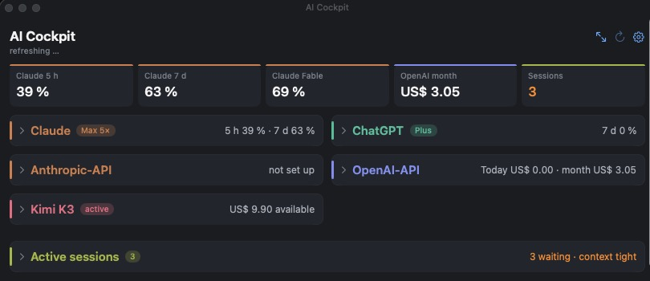
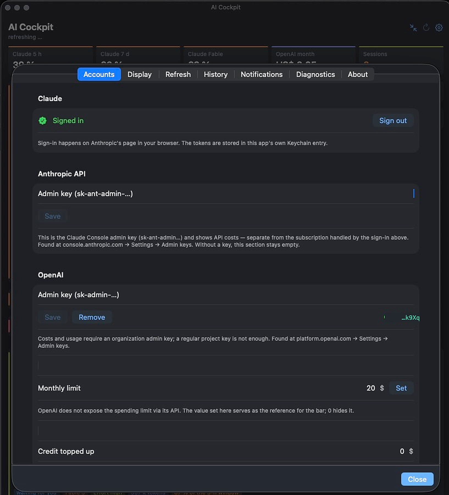
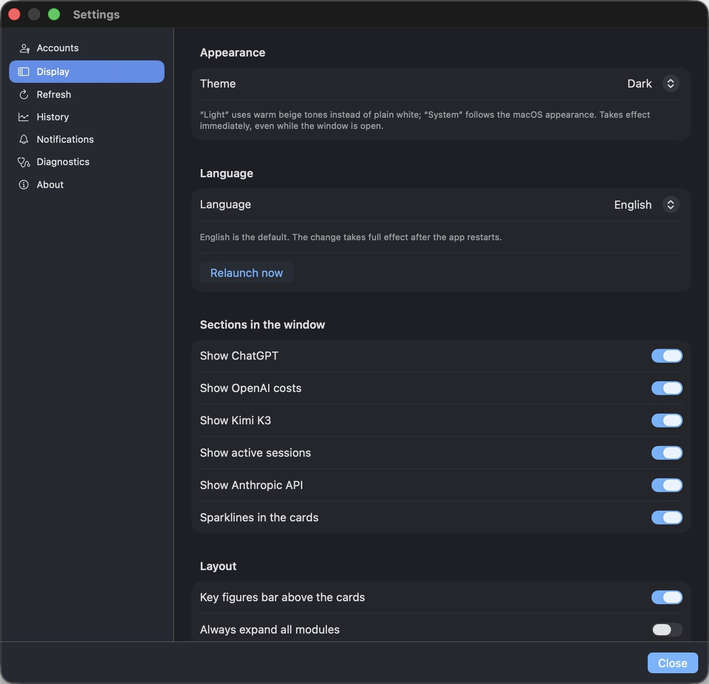
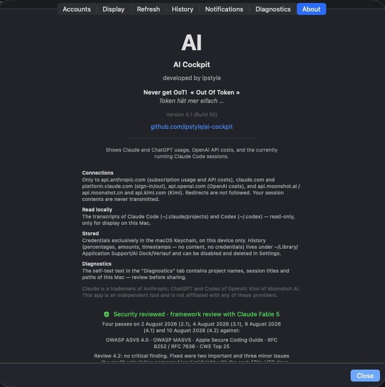

# AI-Cockpit — Dokumentation

*[English version → README.md](README.md)*

<a href="https://apps.apple.com/app/id6802014255">
  <picture>
    <source media="(prefers-color-scheme: dark)" srcset="img/mas-badge-de-dark.svg">
    
  </picture></a>

**Website: [aicockpit.info/de](https://aicockpit.info/de/)** · CHF 4.00 / $3.49, einmalig · [Weitere Apps](https://ipstyle.github.io)

Eine macOS-Menüleisten-App, die alle KI-Budgets an einem Ort zeigt: Auslastung
des Claude-Abos, ChatGPT/Codex-Kontingente, OpenAI-API-Kosten,
Anthropic-API-Kosten, Kimi-Guthaben, OpenRouter-Guthaben, Grok-Guthaben (xAI)
und GitHub-Copilot-Nutzung — dazu die gerade laufenden Claude-Code-Sitzungen
auf deinem Mac, mit Subagenten, Token-Anteilen und Kontextfenstern.

Standard Englisch, Deutsch wählbar unter Einstellungen → Anzeige.
Braucht macOS 14. Die Bildschirmfotos zeigen die englische Oberfläche.

Diese Seite beschreibt **Fassung 6.3**, seit dem 29. August 2026 im App
Store erhältlich.

**Hochgeladen, noch nicht eingereicht: 6.4.** Ein achter Anbieter,
**GitHub Copilot**, sowohl in dieser App als auch in AI Cockpit Mobile. Er
meldet nur Zahlen bei einem privat bezahlten Copilot-Abo — bei firmen- oder
organisationsverwalteten Sitzen gibt GitHub die Nutzung nur auf
Organisationsebene heraus, diese Konten zeigen auf der Karte nichts.
ChatGPT-Zahlen wechseln auf einen **Live-Abruf** nach einmaliger Anmeldung
statt nur lokal protokollierte Codex-Sitzungen zu lesen, dazu ein
Guthaben-Wert auf der ChatGPT-Karte, eine Störungsanzeige je Anbieter,
Widgets für den Schreibtisch, eine kompakte Menüleisten-Kapsel mit bis zu vier
Werten, ein Segmentwähler über den Karten und eine frei zusammenstellbare
Kennzahlenleiste.

**Neu in 6.3: eine Zeile für das, was KI diesen Monat kostet.** Abo-Preise
einmal eintragen (Einstellungen → Anzeige → Abokosten), und das Cockpit legt
die laufenden API-Kosten obendrauf — Kimi und Grok bleiben draussen, weil
beide nur einen Kontostand melden, keinen Monatsverbrauch. Zwei gleichrangige
Links unter Einstellungen → Über: Feedback senden oder die App bewerten; und
die App darf jetzt selbst um eine Bewertung bitten, selten, erst nach Tagen
erfolgreicher Nutzung.

**Ebenfalls an Bord: ein zweites Claude-Konto**, seit 6.1. Wer privat und
geschäftlich getrennte Abos hat, konnte bisher nur eines hinterlegen, weil
eine zweite Anmeldung die erste überschrieb. Das zweite bekommt eine eigene
Karte, ein eigenes Zeichen («C2») und eine eigene Farbe, und **beide lassen
sich benennen** — der Name steht auf der Karte, in der Menüleiste und in den
Mitteilungen. Ohne zweites Konto ändert sich nichts. Dazu ein Demomodus, ein
Einrichtungsassistent beim ersten Start und ein «Alles zurücksetzen» in den
Einstellungen.

Daneben gibt es **[AI Cockpit Mobile](https://apps.apple.com/app/id6803496344)** — eine iPhone- und
iPad-Fassung für CHF 4.00/$3.49 mit Apple-Watch-Begleiter, seit dem 29. August 2026 im
App Store. Sie teilt sich den Quellcode mit dieser App (geschlossen wie hier)
und holt ihre Karten direkt auf dem Gerät.

## Bildschirmfotos

Das Menüleistensymbol — Gehirn, «AI-C» und beide Fenster, in unter 50 Punkten:

Vier Menüleisten-Stile — beide Fenster · kritischster Wert · Ring · Restzeit:

   

Das volle Cockpit — Anbieter nebeneinander, Sparklines, Hochrechnung,
Kostenaufteilung je Modell und Projekt:

Jede Karte lässt sich auf eine Zeile einklappen — Warnungen bleiben farbig
sichtbar:

| Konten | Anzeige |
|---|---|
|  |  |

Über-Seite mit Transparenzangaben (Verbindungen, lokal Gelesenes,
Gespeichertes) und dem Prüfprotokoll:

## Funktionen

- **Menüleiste auf einen Blick** — Gehirn-Symbol mit zwei Zahlen deiner Wahl;
  alternative Stile (kritischster Wert, Ring, Restzeit) für volle Menüleisten.
  Die Symbolbreite wird gemessen, nicht geraten.
- **Du wählst, was in der Menüleiste steht** — zwei Felder in den Einstellungen
  bestimmen den ersten und den zweiten Wert, aus allem, was die App gerade
  kennt: die zwei Claude-Fenster, jedes modellbezogene Wochenfenster, beide
  ChatGPT/Codex-Fenster, Kimis Coding-Kontingent, OpenRouters Schlüssellimit,
  Groks Ausgabendeckel. Angeboten wird nur, was Daten hat; zeigt eine
  gespeicherte Wahl ins Leere, rutscht die Anzeige auf das erste verfügbare
  Fenster, statt leer zu bleiben.
- **Karten dorthin, wo du sie willst** — jede Karte lässt sich innerhalb ihrer
  Spalte oder in die andere hinüberziehen; die Anordnung bleibt je Spalte
  gemerkt, und in den Einstellungen gibt es ein Zurücksetzen.
- **Jede Karte trägt ihr eigenes Zeichen** — ein kleines farbiges Quadrat mit
  dem Anfangsbuchstaben des Dienstes vor jedem Kartennamen: C für Claude,
  C2 für ein zweites Claude-Konto, G für ChatGPT, O für die OpenAI-API,
  A für die Anthropic-API, K für Kimi, R für OpenRouter, X für Grok,
  GC für GitHub Copilot, S für die Sitzungen. Buchstaben, nicht die Logos
  der Anbieter.
- **Claude-Abo** — 5-Stunden- und 7-Tage-Fenster, modellbezogene Wochenfenster,
  Zurücksetzungszeiten, Sparklines und Hochrechnung («bei diesem Tempo voll um
  16:44»). **Auf Wunsch zweimal:** Ein zweites Konto bekommt eine eigene Karte
  mit eigenem Namen, eigener Farbe und eigenen Zahlen.
- **ChatGPT/Codex** — Kontingente live; keine eigene Anmeldung, die bestehende
  wird genutzt.
- **OpenAI-API** — Kosten heute / Monat / gesamt, je Modell und je Projekt,
  Budget-Balken, Monatsbericht als HTML oder CSV, und das **verfügbare
  Guthaben**: OpenAI gibt den Stand nicht über die Schnittstelle heraus, darum
  erfasst man Aufladebetrag und Datum einmal, und die App zieht die
  abgerechneten Tageskosten ab.
- **Anthropic-API** — Kosten neben dem Abo, per Admin-Schlüssel.
- **Kimi** — verfügbares Guthaben und Coding-Abo-Kontingent.
- **OpenRouter** — Guthaben, Verbrauch und das Limit deines Schlüssels. Der
  gewöhnliche Schlüssel aus openrouter.ai unter Keys genügt — anders als bei
  OpenAI und Anthropic braucht es keine Organisation und keinen Admin-Zugang.
- **Grok (xAI)** — Guthaben und Ausgabendeckel deines xAI-Kontos.
- **GitHub Copilot** *(hochgeladen in 6.4, noch nicht eingereicht)* — Premium-Anfragen aus einem privat bezahlten Abo; ein
  firmen- oder organisationsverwalteter Sitz meldet nur auf
  Organisationsebene, seine Karte bleibt dann leer.
- **Aktive Claude-Code-Sitzungen** — Zustand, Modell, Aufwand, verrechnete
  Token, Anteil am laufenden 5-Stunden-Fenster, Füllstand des Kontextfensters,
  Subagenten.
- **Hinweise** — beim Überschreiten von Schwellen, bei absehbarem Volllaufen,
  wenn eine Sitzung auf dich wartet, und bevor ein Kontextfenster voll ist.
- **Mach es zu deinem Cockpit** — Dunkel (Standard), warmes Hell oder System;
  Englisch oder Deutsch; nur die Karten zeigen, die du nutzt; Schwellen,
  Abrufintervalle und Verlaufsdauer sind einstellbar.

## Schnellstart

Installiert — und dann? **Seit 6.1 fragt die App von sich aus:** Beim ersten
Start öffnet ein Assistent in vier Schritten — was sie tut, welche Dienste du
nutzt, die Zugänge dazu, fertig. Überspringen geht in jedem Schritt, und
alles Untenstehende lässt sich auch später in den Einstellungen nachholen.
Sein erster Schritt öffnet ausserdem den Demomodus, damit man sich umsehen
kann, bevor man sich irgendwo anmeldet.

1. **Bei Claude anmelden** — der Assistent bietet es direkt an; später über
   die Fusszeile der Karte → «Bei Claude anmelden»: OAuth im Browser, nichts
   abzutippen.
2. **API-Schlüssel eintragen** — Einstellungen → Konten: OpenAI-Admin-Schlüssel
   (`sk-admin-…`) von platform.openai.com → Settings → Admin keys,
   Anthropic-Admin-Schlüssel (`sk-ant-admin-…`) aus console.anthropic.com
   ein Kimi-Schlüssel von platform.kimi.ai (bzw. .com für China), ein
   OpenRouter-Schlüssel aus openrouter.ai → Keys und/oder ein xAI-Schlüssel
   für Grok. Nur eintragen, was du nutzt — jede Karte ist optional.
3. **ChatGPT — nichts zu tun:** läuft, sobald die ChatGPT-App mit Codex
   installiert und angemeldet ist.
4. **Sitzungen zeigen** — einmalig Lesezugriff auf `~/.claude` gewähren, wenn
   die Karte fragt.

## Berechtigungen

| Berechtigung | Wozu | Pflicht? |
|---|---|---|
| Schlüsselbund | API-Schlüssel und Claude-Anmeldung auf diesem Gerät speichern | ja, je Zugang |
| Mitteilungen | Schwellen- und Hochrechnungswarnungen | nein |
| Lesen von `~/.claude` und `~/.codex` | laufende Sitzungen und Kontingente anzeigen — nur lesend | nur für diese Funktionen |

## Privatsphäre & Sicherheit

- **Verbindungen ausschliesslich zu:** `api.anthropic.com`, `claude.com` /
  `platform.claude.com` (OAuth-Anmeldung), `api.openai.com`,
  `api.moonshot.ai` / `api.moonshot.cn` / `api.kimi.com`, `openrouter.ai` und
  `management-api.x.ai`. Weiterleitungen werden nie befolgt; keine Telemetrie,
  keine Analytics, kein Update-Nachhausetelefonieren.
- **Sitzungsinhalte werden nie übertragen.** Transkripte werden lokal und nur
  für die Anzeige gelesen.
- **Zugangsdaten** liegen ausschliesslich im macOS-Schlüsselbund
  (`kSecAttrAccessibleAfterFirstUnlockThisDeviceOnly`).
- **Der Verlauf** speichert nur Prozentwerte, Beträge und Zeitstempel und
  lässt sich in den Einstellungen abschalten und löschen.
- **Sicherheitsgeprüft:** vier dokumentierte Prüfdurchgänge gegen OWASP ASVS
  4.0, OWASP MASVS, Apple Secure Coding Guide, RFC 8252/7636 und die CWE
  Top 25 — das vollständige Protokoll steht auf der Über-Seite der App. Das ist
  eine dokumentierte modellgestützte Prüfung, kein externes Audit.

## Feedback

Fehlt ein Anbieter? Wünschst du dir eine Kennzahl, die das Cockpit noch nicht
zeigt? → [aicockpit.info/de/#feedback](https://aicockpit.info/de/#feedback)

---

© 2026 Albert Frick (ipstyle). Alle Rechte vorbehalten. Dieses Repository
enthält nur Dokumentation und Bildschirmfotos; die App selbst ist proprietär.
Claude ist eine Marke von Anthropic, ChatGPT und Codex von OpenAI, Kimi von
Moonshot AI, Grok von xAI, OpenRouter von OpenRouter, Inc. AI-Cockpit ist ein
unabhängiges Werkzeug und steht mit keinem dieser Anbieter in Verbindung.
