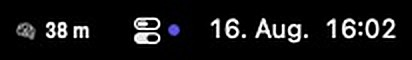
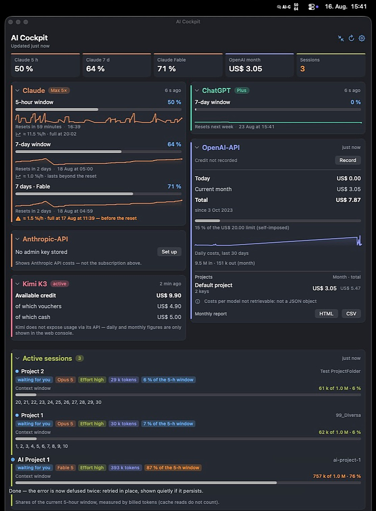
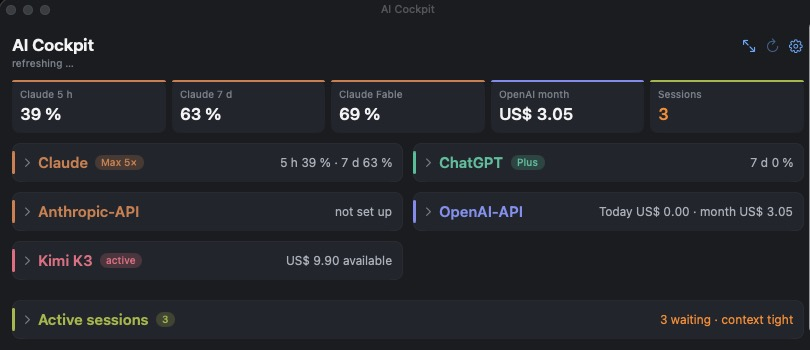
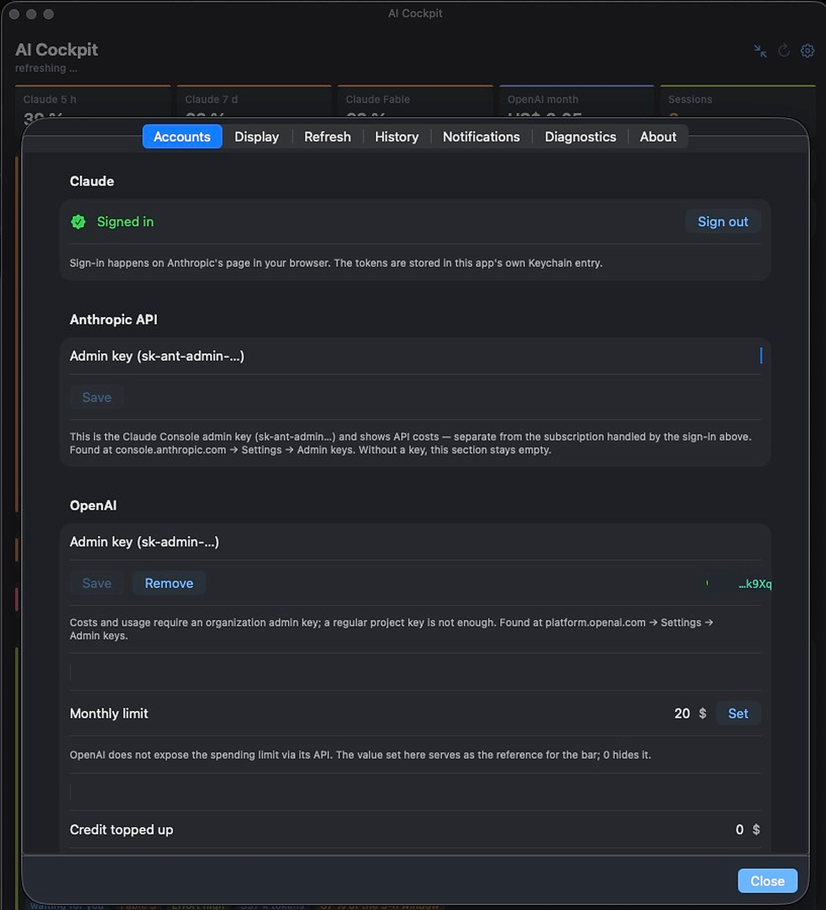
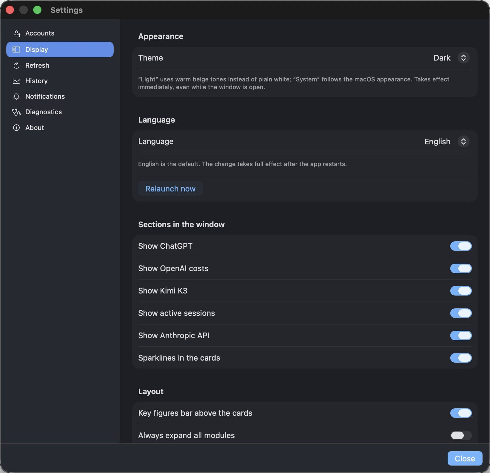
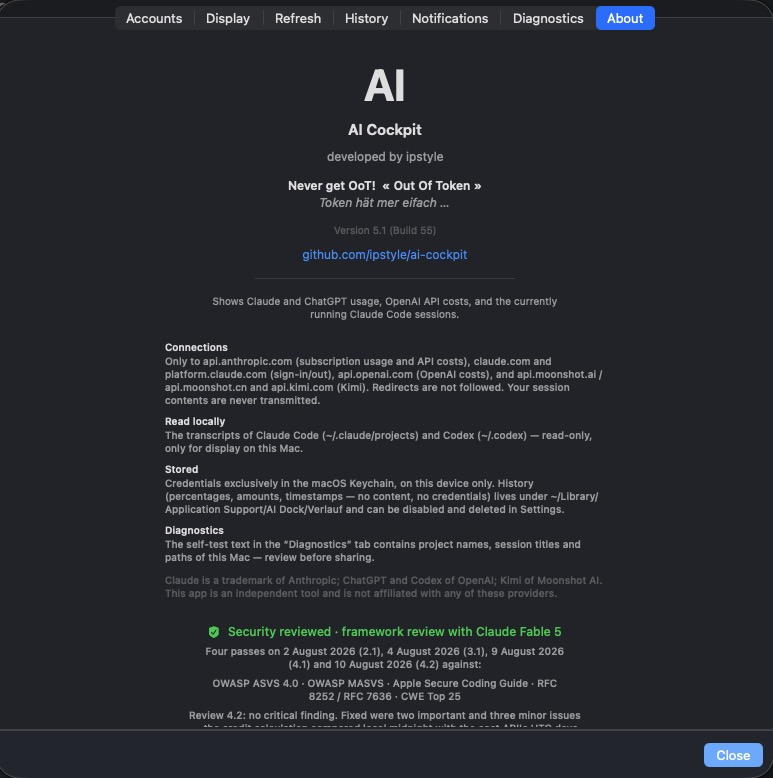

# AI-Cockpit — Documentation

*[Deutsche Version → README.de.md](README.de.md)*

<a href="https://apps.apple.com/app/apple-store/id6802014255?pt=129315066&ct=github-readme&mt=12">
  <picture>
    <source media="(prefers-color-scheme: dark)" srcset="img/mas-badge-en-dark.svg">
    
  </picture></a>

**Website: [aicockpit.info](https://aicockpit.info)** · Free · [More apps](https://ipstyle.github.io)

A macOS menu bar app that keeps every AI budget you have in one place: Claude
subscription usage, ChatGPT/Codex quotas, OpenAI API costs, Anthropic API
costs, Kimi credit, OpenRouter credits, Grok (xAI) balance, GitHub Copilot
usage and — from 7.2 — your DeepSeek balance: nine services, plus the Claude Code sessions currently running on your Mac, with
their subagents, token shares and context windows.

English by default, German selectable in Settings → Display. Requires macOS 14.

This page describes **version 6.8**, released on the App Store on
30 September 2026. **Version 7.2** was submitted to Apple on 3 October 2026
and is in review; it includes 6.9, 7.0 and 7.1, which were withdrawn before
release and never came out on their own.

**Free since 1 September 2026.** AI-Cockpit no longer costs anything. In place
of the price sits a voluntary tip — Espresso, Cappuccino or Dinner — as an
in-app purchase under Settings → About; it does not unlock anything and
changes nothing about the app. It is live on the Mac and on iPhone.

**Coming in 7.2 (in review):** a **forecast under every window** — when a
quota runs full at your pace, before the reset — a right-click menu on the
menu bar icon and a new **Accounts page**. **DeepSeek** as the ninth service — your
balance per currency, with what you topped up and what was granted, never
added up across currencies; the card says so when the balance runs out. A
**search field in the settings** finds every switch in English and German.
And everything from 6.9: every quota as **used or left** (menu bar included),
a **time marker** that says “15 % over plan”, “on plan” or “under plan”, a
**widget you can set up** (one source or all, with Codex credits and a live
countdown — add it once more after updating), and calmer refresh intervals.
In detail: [aicockpit.info/whats-new-mac.html](https://aicockpit.info/whats-new-mac.html).

**New in 6.8:** the **Usage** window — where your Claude and Codex quota went,
by project, model and hour, up to a year back, with an HTML or CSV report;
history keeps 180 days; a monthly budget for all API costs warns at 75 and
100 %. Fixed: Anthropic API costs showed a hundred times too high, and session
tokens were counted about 2.7 times.

**New in 6.7:** The ChatGPT card showed the Codex credit balance as a dollar
amount. Those credits have no cash value, so balance and spend since the start
of the month now read as **credits**, with no conversion to dollars. The App
Store listing has new screenshots showing all eight services.

**New in 6.6:** GitHub Copilot now queries **both** of GitHub's billing paths
— premium requests and the new AI credits it switched some accounts to on
1 June 2026 — and shows whichever one carries figures, instead of silently
showing zero for switched accounts. The model-scoped weekly window's fallback
now correctly points at Fable instead of Opus. No other change from 6.5; both
fixes came from the shared core and were simply missing from the Mac build.

**New in 6.5:** An eighth provider, **GitHub Copilot** — it reports figures
for a personally paid Copilot plan; GitHub exposes usage for company- or
organization-managed seats at the organization level only, so those accounts
show nothing on this card. ChatGPT figures now come from a **live fetch**
after a one-time sign-in instead of only reading locally logged Codex
sessions, plus a balance figure on the ChatGPT card. Also new: an outage
indicator per provider, desktop widgets, a compact menu bar capsule with up
to four values, a segment switcher above the cards, a freely arranged
key-figures bar, and an optional tip (Espresso, Cappuccino or Dinner) under
Settings → About.

**New in 6.3: one line for what AI costs you this month.** Enter your
subscription prices once (Settings → Display → Subscription costs) and the
cockpit adds your live API spend on top — Kimi and Grok stay out of the sum,
since both only report a balance, not a monthly spend. Two equal links sit in
Settings → About: send feedback, or rate the app; and the app may now ask for
a rating itself, rarely, only after days of successful use.

**Also in this app: a second Claude account**, since 6.1. If you keep personal
and work subscriptions apart, you could only store one before, because
signing in a second time overwrote the first. The second one gets its own
card, its own mark («C2») and its own colour, and **both can be named** — the
name appears on the card, in the menu bar and in notifications. Nothing
changes if you do not add one. A demo mode, a setup assistant on first launch
and a «reset everything» in the settings round out the picture.

There is also **[AI Cockpit for iPhone](https://apps.apple.com/app/apple-store/id6803496344?pt=129315066&ct=github-readme&mt=8)** — a free iPhone & iPad
edition with an Apple Watch companion, on the App Store since August 2026,
now at **version 2.13** (released 3 October 2026): DeepSeek, a watch
complication you set up, widgets that renew an expired sign-in themselves, a
forecast under every window and a refresh button in the widget. It shares this app's
source (closed, like this one) and fetches its cards directly on the device.

And there is **AI Cockpit for Windows** — free, outside the stores, in the
notification area of the taskbar. **Version 1.6.0** is out since 3 October 2026
on [GitHub](https://github.com/ipstyle/ai-cockpit-windows/releases/tag/v1.6.0): all nine services, an Accounts overview, a search
in the settings, the forecast under every window and GitHub outages for Copilot. It is unsigned and has not yet run on
a real Windows PC — the release notes say so.

## Screenshots

The menu bar icon — brain, «AI-C» and both usage windows, in under 50 pt:

Four menu-bar styles — both windows · most critical value · ring · time
remaining:

   

The full dashboard — providers side by side, sparklines, forecasts, cost
breakdown per model and project:

Every card collapses to a one-line summary — warnings stay visible in colour:

| Accounts | Display |
|---|---|
|  |  |

About page with transparency notes (connections, local reads, storage) and the
security review record:

## Features

- **Menu bar at a glance** — brain icon with two usage figures of your
  choosing; alternative styles (most critical value, ring, time remaining) for
  narrow menu bars. The icon width is measured, not guessed.
- **You pick what the menu bar shows** — two fields in the settings choose the
  first and the second figure, from every window the app currently holds: the
  two Claude windows, each model-scoped weekly window, both ChatGPT/Codex
  windows, Kimi's coding quota, OpenRouter's key limit, Grok's spending cap.
  Only windows with data are offered, and a stored choice that goes stale
  falls back to the first available window instead of leaving a blank.
- **Cards go where you put them** — drag any card within its column or across
  to the other one; the arrangement is remembered per column, and there is a
  reset in the settings.
- **Every card carries its own mark** — a small coloured square with the
  service's initial in front of each card name: C for Claude, C2 for a second
  Claude account, G for ChatGPT, O for the OpenAI API, A for the Anthropic API,
  K for Kimi, R for OpenRouter, X for Grok, GC for GitHub Copilot, DS for
  DeepSeek (from 7.2), S for sessions. Letters, not the providers' logos.
- **Claude subscription** — 5-hour and 7-day windows, per-model weekly windows,
  reset times, trend sparklines and a forecast («at this pace, full at 16:44»).
  **Twice over if you want:** a second account sits on its own card, with its
  own name, colour and figures.
- **ChatGPT/Codex** — live quotas; no extra sign-in, it reuses the one you
  already have.
- **OpenAI API** — costs today / month / total, per model and per project,
  budget bar, monthly report as HTML or CSV, and a **credit balance**: OpenAI
  does not expose the balance via API, so you record top-up amount and date
  once and the app subtracts the billed daily costs.
- **Anthropic API** — costs next to the subscription, via admin key.
- **Kimi** — available balance and coding-plan quota.
- **OpenRouter** — credits, spend and the rate limit on your key. An ordinary
  key from openrouter.ai under Keys is enough; no organisation, no admin
  access.
- **Grok (xAI)** — balance and spending cap from your xAI account.
- **GitHub Copilot** — premium request or AI credit usage (whichever billing
  path the account is on) from a personally paid plan; a company- or
  organization-managed seat reports only at the organization
  level, so its card stays empty.
- **DeepSeek** (from 7.2) — balance per currency, topped up and granted; an
  ordinary API key from platform.deepseek.com is enough. DeepSeek offers no
  usage endpoint, and the card says so.
- **Active Claude Code sessions** — state, model, effort, billed tokens, share
  of the current 5-hour window, context window fill level, subagents.
- **Notifications** — on threshold crossings, on forecasted exhaustion, when a
  session is waiting for you, and before a context window fills up.
- **Make it yours** — dark (default), warm light or system theme; English or
  German; show only the cards you use; thresholds, refresh rates and history
  are all configurable.

## Quick start

Installed — and then? **Since 6.1 the app asks you itself:** a four-step
assistant opens on first launch — what it does, which services you use, the
credentials for them, done. Skip works on every step, and everything below
can be done later in the settings. Its first step also opens the demo mode,
so you can look around before signing in to anything.

1. **Sign in to Claude** — the assistant offers it directly; later, the card
   footer → «Sign in to Claude»: OAuth in your browser, nothing to copy
   over.
2. **Add your API keys** — Settings → Accounts: OpenAI admin key
   (`sk-admin-…`) from platform.openai.com → Settings → Admin keys, Anthropic
   admin key (`sk-ant-admin-…`) from console.anthropic.com, a Kimi key
   from platform.kimi.ai (or .com for China), an OpenRouter key from
   openrouter.ai → Keys, an xAI key for Grok and/or, from 7.2, a DeepSeek key
   from platform.deepseek.com. Add only what you use —
   every card is optional.
3. **ChatGPT — nothing to do:** works as soon as the ChatGPT app with Codex is
   installed and signed in.
4. **See your sessions** — grant read-only access to `~/.claude` once when the
   card asks.

## Permissions the app asks for

| Permission | Why | Mandatory? |
|---|---|---|
| Keychain | store your API keys and the Claude sign-in on this device | yes, per credential |
| Notifications | threshold and forecast alerts | no |
| Read `~/.claude` and `~/.codex` | show running sessions and quotas — read-only | only for those features |

## Privacy & security

- **Connections go exclusively to:** `api.anthropic.com`, `claude.com` /
  `platform.claude.com` (OAuth sign-in), `api.openai.com`, `auth.openai.com`,
  `chatgpt.com`, `api.moonshot.ai` / `api.moonshot.cn` / `api.kimi.com`,
  `openrouter.ai`, `management-api.x.ai`, `api.github.com`, `api.deepseek.com`
  (from 7.2) and the status
  pages `status.claude.com`, `status.openai.com`, `status.moonshot.cn`.
  Redirects are never followed; there is no telemetry,
  no analytics, no update phone-home.
- **Session contents are never transmitted.** Transcripts are read locally and
  only for display.
- **Credentials** live exclusively in the macOS Keychain
  (`kSecAttrAccessibleAfterFirstUnlockThisDeviceOnly`).
- **History** records only percentages, amounts and timestamps, and can be
  disabled and deleted in Settings.
- **Security-reviewed:** four documented review passes against OWASP ASVS 4.0,
  OWASP MASVS, the Apple Secure Coding Guide, RFC 8252/7636 and the CWE
  Top 25 — the full record ships in the app's About page. This is a documented
  model-assisted review, not an external audit.

## Feedback

Missing a provider? Want a metric the cockpit doesn't show yet?
→ [aicockpit.info/#feedback](https://aicockpit.info/#feedback)

---

© 2026 Albert Frick (ipstyle). All rights reserved. This repository contains
documentation and screenshots only; the application itself is proprietary.
Claude is a trademark of Anthropic; ChatGPT and Codex of OpenAI; Kimi of
Moonshot AI; Grok of xAI; OpenRouter of OpenRouter, Inc.; GitHub Copilot of
GitHub; DeepSeek of DeepSeek. AI-Cockpit is an
independent tool and is not affiliated with any of these providers.
